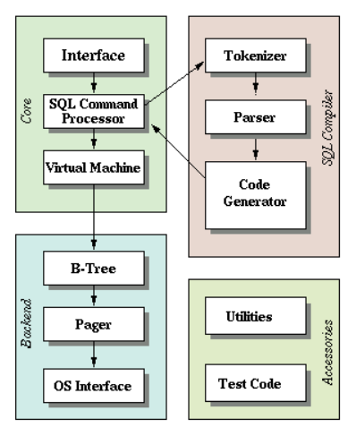

# TinyDB-C

## Intro

> **“What I cannot create, I do not understand.” – Richard Feynman**

[Let's Build a Simple Database](https://cstack.github.io/db_tutorial/)

该项目使用**C语言**实现**基于B树的小型关系型数据库**，实现了数据库最为基本的**增删改查**操作。

**整体架构图**：



**关键结构描述**：


**每一页的存储结构图：**


## Run


```bash
pengge@pengge-virtual-machine:~/Desktop/tDB$ make clean
pengge@pengge-virtual-machine:~/Desktop/tDB$ make
pengge@pengge-virtual-machine:~/Desktop/tDB$ ./main store.db
sqlite> insert 1 2 3 
Executed.
sqlite> insert 2 3 4
Executed.
sqlite> insert 3 4 5
Executed.
sqlite> insert 4 5 6
Executed.
sqlite> insert 5 6 7
Executed.
sqlite> insert 6 7 8
Executed.
sqlite> insert 7 8 9
Executed.
sqlite> insert 8 9 9
Executed.
sqlite> delete 1 2 3
Error: Syntax error.
sqlite> delete 1
Executed.
sqlite> update 2 3 4 2 3 5
Executed.
sqlite> .btree
Tree:
leaf (size 7)
  - 0 : 2
  - 1 : 3
  - 2 : 4
  - 3 : 5
  - 4 : 6
  - 5 : 7
  - 6 : 8
 sqlite> select
(2, 3, 5)
(3, 4, 5)
(4, 5, 6)
(5, 6, 7)
(6, 7, 8)
(7, 8, 9)
(8, 9, 9)
Executed.
sqlite> .exit
```

注意`gcc`的版本

```bash
pengge@pengge-virtual-machine:~/Desktop/tDB$ gcc -v
Using built-in specs.
COLLECT_GCC=gcc
COLLECT_LTO_WRAPPER=/usr/lib/gcc/x86_64-linux-gnu/9/lto-wrapper
OFFLOAD_TARGET_NAMES=nvptx-none:hsa
OFFLOAD_TARGET_DEFAULT=1
Target: x86_64-linux-gnu
Configured with: ../src/configure -v --with-pkgversion='Ubuntu 9.4.0-1ubuntu1~20.04.1' --with-bugurl=file:///usr/share/doc/gcc-9/README.Bugs --enable-languages=c,ada,c++,go,brig,d,fortran,objc,obj-c++,gm2 --prefix=/usr --with-gcc-major-version-only --program-suffix=-9 --program-prefix=x86_64-linux-gnu- --enable-shared --enable-linker-build-id --libexecdir=/usr/lib --without-included-gettext --enable-threads=posix --libdir=/usr/lib --enable-nls --enable-clocale=gnu --enable-libstdcxx-debug --enable-libstdcxx-time=yes --with-default-libstdcxx-abi=new --enable-gnu-unique-object --disable-vtable-verify --enable-plugin --enable-default-pie --with-system-zlib --with-target-system-zlib=auto --enable-objc-gc=auto --enable-multiarch --disable-werror --with-arch-32=i686 --with-abi=m64 --with-multilib-list=m32,m64,mx32 --enable-multilib --with-tune=generic --enable-offload-targets=nvptx-none=/build/gcc-9-Av3uEd/gcc-9-9.4.0/debian/tmp-nvptx/usr,hsa --without-cuda-driver --enable-checking=release --build=x86_64-linux-gnu --host=x86_64-linux-gnu --target=x86_64-linux-gnu
Thread model: posix
gcc version 9.4.0 (Ubuntu 9.4.0-1ubuntu1~20.04.1)
```

## Feature

改进点：

- 仓库中的B树实现不完整。
- 该数据库只能单机使用。
- 未加入事务等操作。

## Reference

- [simple-db-in-c](https://github.com/flower-corp/simple-db-in-c)

- [闲来无事，写个数据库吧](https://blog.csdn.net/weixin_51275728/article/details/124524036)

